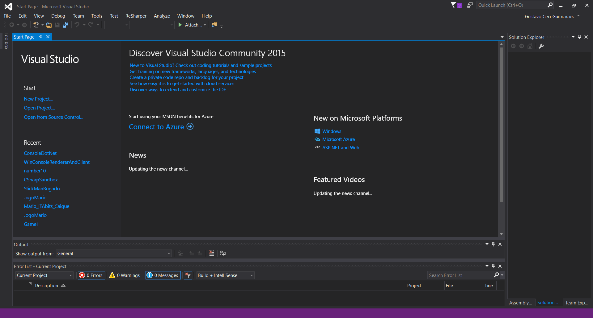
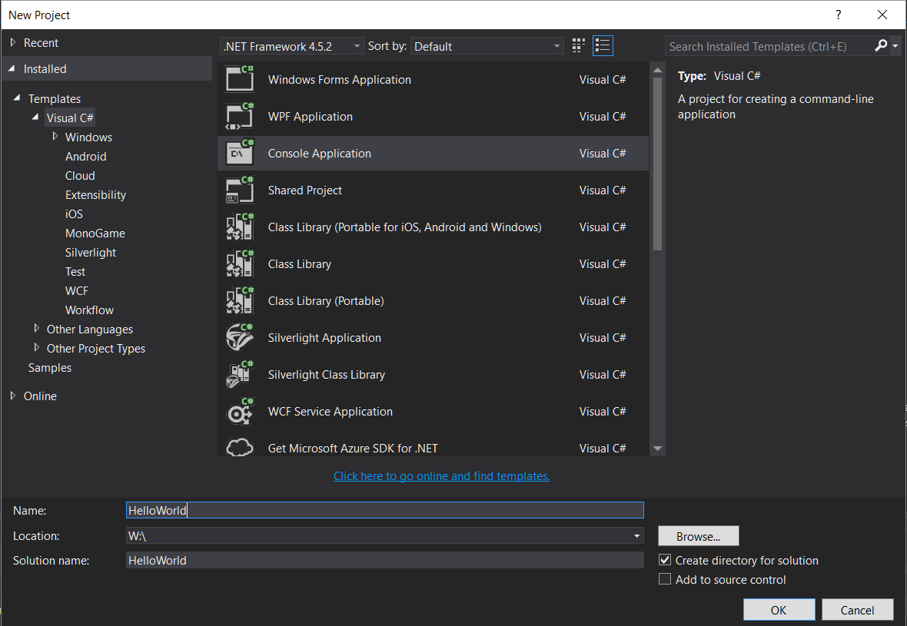
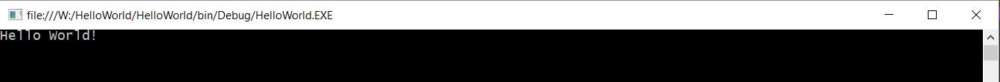

# Visual Studio

Antes de tudo, é altamente recomendado instalar o **Visual Studio**, que será o ambiente de desenvolvimento utilizado a partir desse ponto nos tutoriais. Você pode baixar a verão express gratuitamente [aqui](https://www.visualstudio.com/downloads/).

O Visual Studio é uma IDE(_integrated development environment_), ou seja, é um programa com ferramentas integradas para auxiliar a programação. É o equivalente ao Code::Blocks e ao Borland para C#, só que **muito** melhor.

Após a instalação, quando se abre o Visual Studio têm-se a seguinte tela:


Para a criação do programa, é necessário primeiramente se criar um projeto (que é basicamente a forma do Visual Studio de facilitar a integração de varios arquivos em um programa só). Vá em **File->New->Project...** Será aberta uma janela como a seguinte:


Escolha **Console Application** e dê um nome para o projeto (foi colocado _HelloWorld_). Então clique em **OK**.

O Visual Studio vai gerar uma estrutura de arquivos com um **Program.cs** já aberto (esse arquivo é o arquivo onde a **main** é implementada).

```cs
using System;
using System.Collections.Generic;
using System.Linq;
using System.Text;
using System.Threading.Tasks;

namespace HelloWorld
{
    class Program
    {
        static void Main(string[] args)
        {
        }
    }
}
```

É perceptivel que a sintaxe é bem parecida com a de C. Apesar da função _Main_ estar dentro de um pouco mais de outras coisas que a de C, ainda é facil de entender que o que estiver escrito ali é o que vai ser executado quando o codigo for executado. Em C# **funções** são chamadas de **métodos**, e a partir de agora ambas as palavras serão usadas com o mesmo significado.

Existem várias palavras novas, e com o tempo a cada uma será dada a sua devida importancia, porém algumas são de assuntos que nao serão tratados nesse tutorial. Por enquanto pode-se encarar tudo como um macaco para que as coisas funcionem. Até o final tudo fará sentido.

Para que seja printado alguma coisa no console basta que o método main execute a seguinte linha de código:

```cs
Console.Write("Hello World!");
```

Pode-se perceber que quando se comeca a digitar algo aparecem diversas sugestoes, esse é o Visual Studio e seu _Intellisense_ em ação. **TAB**, **ESPAÇO** ou **ENTER** completam com a sugestão dada, que pode ser simplesmente ignorada se continuar digitando. O _Intellisense_ será muito útil pra saber os possiveis metodos a se usar em diversos momentos.

Aperte F5 ou a setinha verde para rodar o programa...

Ele deve ter sumido antes de dar para ler o output. Adicione:

```cs
// Acochambração analoga ao do scanf() no final...
Console.Read();
```

A seguinte saída é a esperada:


Pronto! O primeiro projeto em C#, o clássico hello world.

Você deve ter percebido que o analogo em C# do printf() é o Console.Write() e do scanf() o Console.Read(). Durante o resto do tutorial serão mostradas as outras principais diferenças na sintaxe.

O codigo feito até agora pode ser encontrado [aqui](https://github.com/ITAbits/treinamento-csharp/tree/hello-world/HelloWorld).

Agora, sabendo criar um hello world, e assim tendo uma sandbox para testarmos nossos conhecimentos, vamos às [principais diferencas entre C++ e C#](https://github.com/ITAbits/treinamento-csharp/blob/master/docs/De-C-para-C%23/Principais-Diferencas.md)
